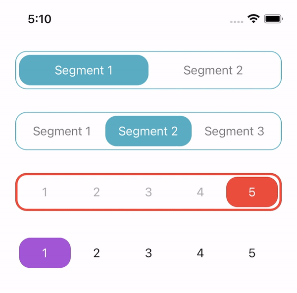
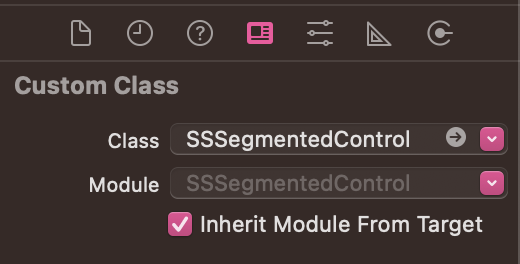
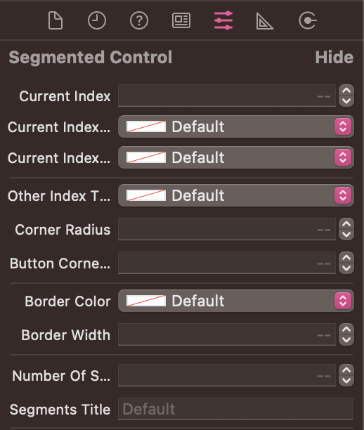

# SSSegmentedControl
Custom Segmented Control for iOS using UIKit

## Example


## Requirements

- iOS 9.0
- Xcode 10.0+
- Swift 4.0+

## How To Use?
### Code:

```swift
import UIKit

//@IBDesignable
class SSSegmentedControl: UIView {
    
    //MARK: - Properties
    var stackView: UIStackView = UIStackView()
    var buttonsCollection: [UIButton] = []
    var currentIndexView: UIView = UIView(frame: .zero)
    
    var buttonPadding: CGFloat = 5
    var stackViewSpacing: CGFloat = 0
    
    //MARK: - Callback
    var didTapSegment: ((Int) -> ())?
    
    //MARK: - Inspectable Properties
    @IBInspectable var currentIndex: Int = 0 {
        didSet {
            setCurrentIndex()
        }
    }
    
    @IBInspectable var currentIndexTitleColor: UIColor = .white {
        didSet {
            updateTextColors()
        }
    }
    
    @IBInspectable var currentIndexBackgroundColor: UIColor = .systemTeal {
        didSet {
            setCurrentViewBackgroundColor()
        }
    }
    
    @IBInspectable var otherIndexTitleColor: UIColor = .gray {
        didSet {
            updateTextColors()
        }
    }
    
    @IBInspectable var cornerRadius: CGFloat = 15 {
        didSet {
            setCornerRadius()
        }
    }
    
    @IBInspectable var buttonCornerRadius: CGFloat = 10 {
        didSet {
            setButtonCornerRadius()
        }
    }
    
    @IBInspectable var borderColor: UIColor = .systemTeal {
        didSet {
            setBorderColor()
        }
    }
    
    @IBInspectable var borderWidth: CGFloat = 1 {
        didSet {
            setBorderWidth()
        }
    }
    
    @IBInspectable var numberOfSegments: Int = 2 {
        didSet {
            addSegments()
        }
    }
    
    @IBInspectable var segmentsTitle: String = "Segment 1,Segment 2" {
        didSet {
            updateSegmentTitles()
        }
    }
    
    //MARK: - Life cycle
    override init(frame: CGRect) { //From code
        super.init(frame: frame)
        
        commonInit()
    }
    
    required init?(coder: NSCoder) { //From IB
        super.init(coder: coder)
        
        commonInit()
    }
    
    override func layoutSubviews() {
        super.layoutSubviews()
        
        setCurrentIndex()
    }
    
    //MARK: - Functions
    private func commonInit() {
        backgroundColor = .clear
        
        setupStackView()
        addSegments()
        setCurrentIndexView()
        setCurrentIndex(animated: false)
        
        setCornerRadius()
        setButtonCornerRadius()
        setBorderColor()
        setBorderWidth()
    }
    
    private func setCurrentIndexView() {
        setCurrentViewBackgroundColor()
        
        addSubview(currentIndexView)
        sendSubviewToBack(currentIndexView)
    }
    
    private func setCurrentIndex(animated: Bool = true) {
        stackView.subviews.enumerated().forEach { (index, view) in
            let button: UIButton? = view as? UIButton
            
            if index == currentIndex {
                let buttonWidth = (frame.width - (buttonPadding * 2)) / CGFloat(numberOfSegments)
                
                if animated {
                    UIView.animate(withDuration: 0.3) {
                        self.currentIndexView.frame =
                            CGRect(x: self.buttonPadding + (buttonWidth * CGFloat(index)),
                               y: self.buttonPadding,
                               width: buttonWidth,
                               height: self.frame.height - (self.buttonPadding * 2))
                    }
                } else {
                    self.currentIndexView.frame =
                        CGRect(x: self.buttonPadding + (buttonWidth * CGFloat(index)),
                           y: self.buttonPadding,
                           width: buttonWidth,
                           height: self.frame.height - (self.buttonPadding * 2))
                }
                
                button?.setTitleColor(currentIndexTitleColor, for: .normal)
            } else {
                button?.setTitleColor(otherIndexTitleColor, for: .normal)
            }
        }
    }
    
    private func updateTextColors() {
        stackView.subviews.enumerated().forEach { (index, view) in
            let button: UIButton? = view as? UIButton
            
            if index == currentIndex {
                button?.setTitleColor(currentIndexTitleColor, for: .normal)
            } else {
                button?.setTitleColor(otherIndexTitleColor, for: .normal)
            }
        }
    }
    
    private func setCurrentViewBackgroundColor() {
        currentIndexView.backgroundColor = currentIndexBackgroundColor
    }
    
    private func setupStackView() {
        stackView.alignment = .fill
        stackView.distribution = .fillEqually
        stackView.spacing = stackViewSpacing
        addSubview(stackView)
        
        stackView.translatesAutoresizingMaskIntoConstraints = false
        NSLayoutConstraint.activate(
            [
                stackView.leadingAnchor.constraint(equalTo: leadingAnchor, constant: buttonPadding),
                stackView.trailingAnchor.constraint(equalTo: trailingAnchor, constant: -buttonPadding),
                stackView.topAnchor.constraint(equalTo: topAnchor, constant: buttonPadding),
                stackView.bottomAnchor.constraint(equalTo: bottomAnchor, constant: -buttonPadding)
            ]
        )
    }
    
    private func addSegments() {
        //Remove buttons
        buttonsCollection.removeAll()
        stackView.subviews.forEach { view in
            (view as? UIButton)?.removeFromSuperview()
        }

        let titles = segmentsTitle.split(separator: ",")
        
        for index in 0 ..< numberOfSegments {
            let button = UIButton()
            button.tag = index
            
            if let index = titles.indices.contains(index) ? index : nil {
                button.setTitle(String(titles[index]), for: .normal)
            } else {
                button.setTitle("<Segment>", for: .normal)
            }
            
            button.titleLabel?.font = .systemFont(ofSize: 16)
            button.addTarget(self, action: #selector(segmentTapped(_:)), for: .touchUpInside)
            
            stackView.addArrangedSubview(button)
            buttonsCollection.append(button)
        }
    }
    
    private func updateSegmentTitles() {
        let titles = segmentsTitle.split(separator: ",")
        
        stackView.subviews.enumerated().forEach { (index, view) in
            if let index = titles.indices.contains(index) ? index : nil {
                (view as? UIButton)?.setTitle(String(titles[index]), for: .normal)
            } else {
                (view as? UIButton)?.setTitle("<Segment>", for: .normal)
            }
        }
    }
    
    private func setCornerRadius() {
        layer.cornerRadius = cornerRadius
    }
    
    private func setButtonCornerRadius() {
        stackView.subviews.forEach { view in
            (view as? UIButton)?.layer.cornerRadius = cornerRadius
        }
        
        currentIndexView.layer.cornerRadius = cornerRadius
    }
    
    private func setBorderColor() {
        layer.borderColor = borderColor.cgColor
    }
    
    private func setBorderWidth() {
        layer.borderWidth = borderWidth
    }
    
    //MARK: - IBActions
    @objc func segmentTapped(_ sender: UIButton) {
        didTapSegment?(sender.tag)
        currentIndex = sender.tag
    }
    
}
```

### Storyboards:
If you're using Storyboards/Interface Builder you can create a `SSSegmentedControl` instance by adding a normal UIView to your Storyboard, and then manually changing the view's class to `SSSegmentedControl` in the "Custom Class" field of the Identity Inspector tab on the Utilities panel (the right-side panel).



### Customisation:
`SSSegmentedControl` includes support for IBInspectable, to allow configuration of the current Index(index, title and background color), other Index(title color), cornerRadius, border(corner radius, color and width), number of segments and titles of each segment inside Interface Builder/Storyboards



## Author
Schaheer Saleem
